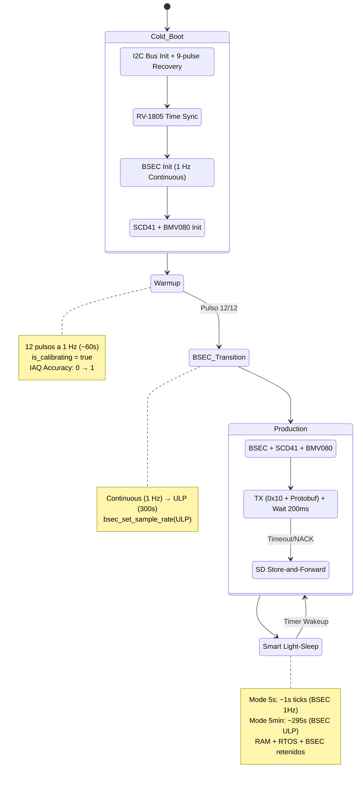

# 🧪 Room-Monitoring: Estación Ambiental de Precisión (ESP-IDF)

[](https://github.com/oscar-bio-dev/room-monitoring/actions/workflows/esp-idf-ci.yml)


Este proyecto implementa un nodo de telemetría ambiental (Calidad del Aire) de grado industrial, exprimiendo al máximo las capacidades de ultra-bajo consumo del silicio **ESP32** integrando instrumentación de alta gama de **Bosch Sensortec (BME688, BMV080)** y **Sensirion (SCD41)**.

---

## 🏗️ Arquitectura de Software y Hardware

El firmware ha sido diseñado bajo los estándares empresariales más estrictos (basado en el RFC-2119 documentado internamente en `AGENTS.md`), priorizando la tolerancia a fallos, la retención física de hardware y una arquitectura limpia basada en componentes.

### Hardware del Nodo

| Componente | Sensor | Interfaz | Medición |
|-----------|--------|----------|----------|
| **Bosch BME688** | MOX + BSEC 3.0 | I2C (0x76) | IAQ, Temperatura, Humedad, Presión, VOCs |
| **Sensirion SCD41** | NDIR fotoacústico | I2C (0x62) | CO₂ (400–5000 ppm), T, H |
| **Bosch BMV080** | Láser óptico | I2C (0x57) | PM1.0, PM2.5, PM10 (µg/m³ + particles/m³), Obstruction |
| **RV-1805-C3** | RTC hardware ±2 ppm | I2C (0x69) | Timestamp de precisión |
| **MicroSD** (onboard) | FATFS on-demand | SPI (VSPI) | Store-and-Forward (Caja Negra) |
| **ESP32-D0WD-V3** | Xtensa dual-core, rev 3.1 | — | MCU + radio ESP-NOW |

### Topología Segregada (Core 0 / Core 1)
- **Core 0 (Pro Core):** Tareas asíncronas pesadas (stack de red, ESP-NOW, telemetría).
- **Core 1 (App Core):** Tareas críticas ancladas vía FreeRTOS dedicadas a los drivers I2C y temporización de sensores láser.

### Carga Útil (Payload) y Enrutamiento Bidireccional
El nodo emplea un enrutamiento por **Byte de Cabecera** sobre ESP-NOW (`0x10` Telemetría, `0x11` Diagnóstico, `0x20` Gateway Ack). Transmite una trama Protobuf (`telemetry.proto`) ultra-optimizada. Gracias a la sinergia *Sensor Fusion*, el payload nominal (98 bytes) integra:
- **Bosch BMV080:** PM1.0, PM2.5, PM10 (masa y conteo numérico), flags de obstrucción, runtime del láser.
- **Sensirion SCD41:** CO₂ real fotoacústico con compensación de presión atmosférica inyectada dinámicamente.
- **Bosch BME688 (BSEC 3.0):** eCO₂, IAQ, Temperatura, Humedad, Presión barométrica y Resistencia de Gas.
- **Salud del Sistema:** Bitmask pasivo de errores de hardware (`system_error_bitmask`) y estatus general del nodo.

### Máquina de Estados (Smart Light-Sleep v1.x)

El nodo opera en un bucle de producción continuo basado en Light-Sleep, que retiene la totalidad de la RAM (RTOS + heap + estado BSEC) entre ciclos:



> **Nota histórica:** La arquitectura original usaba Deep Sleep como ciclo maestro (WAKE_A → Light-Sleep 4.85s → WAKE_B → Deep Sleep). Este diseño fue abandonado tras la auditoría de BSEC que demostró incompatibilidad temporal del filtro de Kalman con el boot del ESP32. El código de Deep Sleep se preserva bajo `#ifdef CONFIG_ENABLE_DEEP_SLEEP`. Ver [ADR-001](docs/ADR-001-Power-Management-BSEC.md).

---

## 🛠️ Resiliencia y Manejo de Errores

Este repositorio implementa tácticas críticas para hardware desplegado en campo:

1. **Bit-Banging Latch-Up Recovery:** Previo a montar el periférico hardware de I2C, el sistema inyecta 9 pulsos de reloj (SCL) manuales. Esto destraba esclavos que se hayan quedado "colgados" tirando de la línea SDA a tierra tras una caída abrupta de voltaje.
2. **Retención de Estado en RAM (Light-Sleep):** En el modo de producción, Smart Light-Sleep retiene la totalidad de la RAM entre ciclos. Las variables de BSEC 3.0, las direcciones I2C dinámicas y el contexto FreeRTOS sobreviven sin necesidad de serialización.
3. **I2C General Call Reset:** Uso del comando broadcast de reset `0x00 -> 0x06` en el bus maestro para forzar un Soft Reset a nivel de silicio en los sensores Bosch, garantizando inicializaciones inmaculadas post-Cold-Boot.
4. **Integridad de mediciones:** Las tres palabras de la trama SCD41 se validan mediante CRC-8 antes de convertirlas a CO₂, temperatura y humedad. Las operaciones SCD41 se reintentan hasta tres veces y los fallos de inicialización de cada sensor deshabilitan únicamente esa medición.
5. **Sincronización de Tiempo Real (RTC Híbrido RV-1805 y BLE Epoch):** En Cold Boot, el sistema arranca sin hora. Mediante el *Estado A* de aprovisionamiento, se inyecta la hora Unix (Epoch de 64 bits) al nodo vía Bluetooth (característica `0xFF05`). Esta hora se desglosa internamente a BCD, se escribe en los registros físicos del RV-1805 (±2 ppm) y se retiene en `gettimeofday()`. Si el RTC agota su batería de respaldo (año < 2024), el nodo reporta el bit `ERR_RTC_RV1805` e impone la marca de tiempo a `0`, forzando que el Gateway asigne su propia hora al recibir la trama y evitar envenenamiento de datos en la nube.
6. **Anticolisión I2C (Clock-Stretching):** Implementación de retardos tácticos mecánicos estables entre la excitación del escáner láser BMV080 (250ms), el disparo del sensor NDIR SCD41 (50ms) y la ráfaga de datos del BME688. Además, el láser BMV080 se sondea mediante *fast-polling* (100ms) durante el calentamiento y rutinas de purgado (15-buffer flush) para evitar fallos catastróficos por desbordamiento de su FIFO interno y bloqueos de bus (`I2C software timeout`).
7. **Transporte Bidireccional Asíncrono:** La transmisión usa ESP-NOW con **Byte de Cabecera** (`0x10`). Tras enviar, el nodo bloquea su tarea principal asíncronamente (cediendo la CPU) durante 200ms a la escucha de un ACK del Gateway (`0x20`). Si el Gateway despacha el comando `CMD_RUN_SELF_TEST`, el nodo pausa la producción e inicia un diagnóstico agresivo a nivel de silicio en todo el bus I2C (SCD41, BME688, BMV080), respondiendo con un `DiagnosticReport` (`0x11`).
8. **Caja Negra Resiliente (Store-and-Forward / Append-Only Log):** Si el Gateway no emite confirmación (ACK), el sistema monta *On-Demand* la MicroSD. Emplea un modelo `Append-Only Log` súper resiliente con un *Magic Word* (`0x4242`) y cálculo de `CRC32` por registro. Esto le permite sobrevivir a fallos de escritura o corrupción de sectores (saltando bytes corruptos) sin tener que formatear la memoria. Posteriormente se purga dinámicamente en lotes pequeños enviándolos al Gateway cuando este recupera la conectividad.

---

## 📊 Diagnóstico en Campo

En cada ciclo de recolección, el firmware registra los motivos de despertar y reinicio, heap libre y el mínimo de stack disponible de la tarea de sensores. Smart Light-Sleep preserva el contexto completo del sistema (I²C, FreeRTOS, BSEC) entre mediciones, garantizando que los diagnósticos reflejen el estado acumulado real del dispositivo.

El BMV080 se integra exclusivamente a través de `bmv080_driver`, que encapsula el SDK binario de Bosch. El callback captura los 6 campos de `bmv080_output_t` (masa + conteo) y los flags de hardware (`is_obstructed`, `is_outside_measurement_range`). Las transferencias I2C se validan y limitan a 512 palabras para proteger el heap ante datos anómalos del SDK. La detección de obstrucción está habilitada para monitoreo de salud del sensor en campo.

---

## 📁 Estructura del Proyecto

```
room-monitoring/
├── main/                        # Orquestador principal (room-monitoring.c)
├── components/
│   ├── bme688_bsec/            # BSEC 3.0 wrapper (fusión sensorial IAQ)
│   ├── bme688_driver/          # Driver bajo nivel BME688
│   ├── bmv080_driver/          # SDK binario Bosch BMV080 (PM láser)
│   ├── bosch_hal/              # HAL compartido Bosch (I2C callbacks)
│   ├── scd41/                  # Driver CO₂ Sensirion (NDIR)
│   ├── rv1805_rtc/             # RTC hardware Qwiic (±2 ppm)
│   ├── i2c_bus/                # Abstracción I2C + Bit-Banging recovery
│   ├── i2c_hal/                # HAL I2C bajo nivel
│   ├── power_manager/          # Gestión de energía y modos de sueño
│   ├── network_manager/        # ESP-NOW (TX/RX, ACK, peer management)
│   ├── storage_manager/        # MicroSD Store-and-Forward (FATFS/SPI)
│   ├── telemetry/              # Empaquetado de datos de telemetría
│   ├── telemetry_proto/        # Nanopb auto-generado (.pb.c/.pb.h)
│   └── nanopb/                 # Upstream Nanopb (protobuf para embedded)
├── proto/                       # telemetry.proto (esquema canónico)
├── docs/                        # ADRs (Architecture Decision Records)
├── .agents/                     # Políticas normativas (3 capas)
│   ├── AGENTS.md               # Capa 1: Política global ejecutiva
│   └── policies/
│       ├── github-governance.md # Capa 2: Estándar GitHub
│       └── sensor-node-profile.md # Capa 3: BOM, erratas, pinout, riesgos
├── CHANGELOG.md
└── README.md
```

---

## 🚀 Compilación y Desarrollo (ESP-IDF)

### 1. Preparar Entorno
```bash
# Cargar variables de compilación del ESP-IDF v5.3+
. $HOME/esp/esp-idf/export.sh
```

### 2. Auto-Mantenimiento de Código (Pre-Commit)
El código debe cumplir estrictamente con los lineamientos de `.clang-format` (Estilo LLVM/Espressif). Asegúrate de tener instalado y activado el hook local:
```bash
pipx install pre-commit
pre-commit install
```

### 3. Compilar, Flashear y Monitorizar
```bash
idf.py set-target esp32
idf.py build flash monitor
```

---

## 🔒 Buenas Prácticas de GitHub (Workspace Rules)
Este proyecto sigue políticas estrictas de gobierno:
- **Commits:** Uso exclusivo de **Conventional Commits** (`feat:`, `fix:`, `docs:`, `refactor:`).
- **Control de Versiones:** `CHANGELOG.md` mantenido bajo estándar **Keep a Changelog** y **SemVer**.
- **Pull Requests:** Código nuevo debe pasar linters, compilación sin warnings en rutas críticas y adjuntar pruebas unitarias.

---

## 📝 Roadmap

- [x] **Fase 1:** Arquitectura de Componentes (HAL BME688) e I2C Recovery.
- [x] **Fase 2a:** Máquina de Estados de Doble Despertar (4.85s) y Aislamiento `gpio_hold_en`.
- [x] **Fase 2b:** Integración Total de SCD41, BMV080, RTC Hardware Híbrido (RV-1805) y estabilización de bus I2C.
- [x] **Fase 3:** Telemetría Resiliente ESP-NOW y "Caja Negra" Store-and-Forward (MicroSD SPI) con Nanopb.
- [x] **Fase 3b:** Auditoría BSEC Deep Sleep — ADR-001 aprobado. Pivot a Smart Light-Sleep. Ver [`docs/ADR-001-Power-Management-BSEC.md`](docs/ADR-001-Power-Management-BSEC.md).
- [x] **Fase 3c:** Smart Light-Sleep implementado (2 modos: 5s Continuous / 5min ULP con `esp_light_sleep_start()` y event loop dinámico BSEC-synced).
- [x] **Fase 3d:** BMV080 Industrial Optimization — Number concentration (particles/m³), obstruction detection, laser lifecycle `start()/stop()`, payload expandido a 98 bytes.
- [x] **Fase 3e:** Transporte Bidireccional y Mailbox Asíncrono — Byte de Cabecera (0x10, 0x11, 0x20), espera de ACK, y Secuenciador de Self-Test Activo a nivel I2C en respuesta a comandos del Gateway.
- [x] **Fase 3f:** Aprovisionamiento BLE (NimBLE GATT Server) y Persistencia NVS. Estado Excluyente A/B (Boot and Release). Timeout de 5 minutos y características: MAC, Intervalo, FRC. (Self-Test y Epoch migrados a arquitectura Cloud-to-Edge).
- [x] **Fase 3g:** Resiliencia de Caja Negra (SD Card). Refactor a modelo Append-Only Log con *Magic Word* (`0x4242`), buffer dinámico de 256B y `CRC32` validado para lectura/escritura corrupta.
- [x] **Fase 3h:** Sincronización Temporal Híbrida. Inyección Epoch vía BLE (`CHAR_EPOCH_SYNC`), conversión BCD RV-1805 y mitigación de Poison-Pills mediante validación estricta de año (>2024).
- [x] **Fase 3i:** Optimización de Batería "Fast-ACK". Reducción de la ventana de RX de 200ms a 50ms, aprovechando la respuesta instantánea (<20ms) de la arquitectura *Downlink Spooling* del co-procesador C6 en el Gateway.
- [x] **Fase 4a:** (Auditoría Técnica Bloque 1) Implementación de Resiliencia de Red. Confirmación durable (Cloud-Accepted) exigiendo el `GatewayAck` (0x20) antes de purgar la MicroSD. Idempotencia global garantizada inicializando `node_sequence` aleatoriamente en *cold boot*. Robustez de cola RX para prevenir *stale ACKs*.
- [x] **Fase 4b:** (Auditoría Técnica Bloque 2) Cierre de Seguridad y Aprovisionamiento Real. BLE Bonding activado, encriptación `BLE_GATT_CHR_F_WRITE_ENC` exigida en características críticas. Integración de `config_manager` (NVS) con la radio ESP-NOW para uso de MAC e intervalo dinámico reales.
- [x] **Fase 4c:** (Auditoría Técnica Bloque 3) Resiliencia de Hardware y Sistema de Archivos. Implementación de rotación atómica por tamaño (256KB) en MicroSD (`offline.dat` -> `offline_bak.dat`) para prevenir RAM exhaustion, y auto-recuperación de la máscara `current_errors` en los sensores I2C durante la producción.
- [ ] **Fase 4d:** (Integración Ecosistema) Pruebas End-to-End (E2E) con el Edge-Telemetry-Gateway. Validación de la inyección asíncrona de comandos (`CMD_RUN_SELF_TEST`) y sincronización automática de Epoch en el `GatewayAck`.
- [ ] **Fase 5:** (Aprovisionamiento Enterprise) Validación E2E con la App Móvil (Setae Connect). Lectura óptica de Código QR y configuración Zero-Touch vía BLE (MAC e inyección del Epoch desde el smartphone del operario).
- [ ] **Fase 6:** Inteligencia Embebida BSEC 3.0 y TinyML. Despliegue de redes neuronales ligeras para Clasificación Química en el Edge (Ej. detección discriminada de tipos de VOCs o gases nocivos).

---

## 📄 Decisiones Arquitectónicas

| ADR | Título | Estado |
|-----|--------|--------|
| [ADR-001](docs/ADR-001-Power-Management-BSEC.md) | Power Management — BSEC Deep Sleep Failure & Smart Light-Sleep Pivot | ✅ Aceptado |
