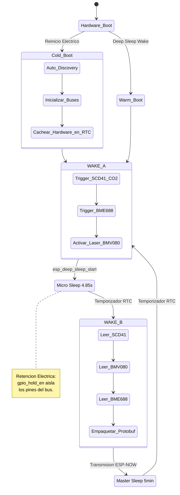

# 🧪 Room-Monitoring: Estación Ambiental de Precisión (ESP-IDF)

[](https://github.com/oscar-bio-dev/room-monitoring/actions/workflows/esp-idf-ci.yml)


Este proyecto implementa un nodo de telemetría ambiental (Calidad del Aire) de grado industrial, exprimiendo al máximo las capacidades de ultra-bajo consumo del silicio **ESP32** (Filosofía Zero-CPU) integrando instrumentación de alta gama de **Bosch Sensortec (BME688, BMV080)** y **Sensirion (SCD41)**.

---

## 🏗️ Arquitectura de Software y Hardware

El firmware ha sido diseñado bajo los estándares empresariales más estrictos (basado en el RFC-2119 documentado internamente en `AGENTS.md`), priorizando la tolerancia a fallos, la retención física de hardware y una arquitectura limpia basada en componentes.

### Topología Segregada (Core 0 / Core 1)
- **Core 0 (Pro Core):** Tareas asíncronas pesadas (Aceleración criptográfica, stack de red, ESP-NOW / TLS 1.3).
- **Core 1 (App Core):** Tareas críticas ancladas vía FreeRTOS dedicadas a los drivers *Bare-Metal* I2C y temporización de sensores láser.

### Máquina de Estados de Doble Despertar (4.85s)

Para cumplir con la asimetría de tiempos requerida por el NDIR (SCD41 = 5s) y el escáner láser (BMV080), el ESP32 entra en un coma inducido entre disparos de instrumentación:



---

## 🛠️ Resiliencia y Manejo de Errores

Este repositorio implementa tácticas críticas para hardware desplegado en campo:
1. **Bit-Banging Latch-Up Recovery:** Previo a montar el periférico hardware de I2C, el sistema inyecta 9 pulsos de reloj (SCL) manuales. Esto destraba esclavos que se hayan quedado "colgados" tirando de la línea SDA a tierra tras una caída abrupta de voltaje.
2. **SRAM Profunda (`RTC_DATA_ATTR`):** Se evita reinicializar térmica y lógicamente el BME688. Los datos de calibración de fábrica se leen una vez y sobreviven al *Deep Sleep*.

---

## 🚀 Compilación y Desarrollo (ESP-IDF)

### 1. Preparar Entorno
```bash
# Cargar variables de compilación del ESP-IDF v5.3+
. $HOME/esp/esp-idf/export.sh
```

### 2. Auto-Mantenimiento de Código (Pre-Commit)
El código debe cumplir estrictamente con los lineamientos de `.clang-format` (Estilo LLVM/Espressif). Asegúrate de tener instalado y activado el hook local:
```bash
pipx install pre-commit
pre-commit install
```

### 3. Compilar, Flashear y Monitorizar
```bash
idf.py set-target esp32
idf.py build flash monitor
```

---

## 📝 Roadmap

- [x] **Fase 1:** Arquitectura de Componentes (HAL BME688) e I2C Recovery.
- [x] **Fase 2a:** Máquina de Estados de Doble Despertar (4.85s) y Aislamiento `gpio_hold_en`.
- [ ] **Fase 2b:** Drivers SCD41, BMV080 y rutina de Auto-Discovery I2C (Base vs Pro Model).
- [ ] **Fase 3:** Inteligencia Embebida BSEC 2.0 y TinyML para Clasificación Química.
- [ ] **Fase 4:** Gateway Criptográfico Ethernet y Telemetría Google Cloud Pub/Sub.
